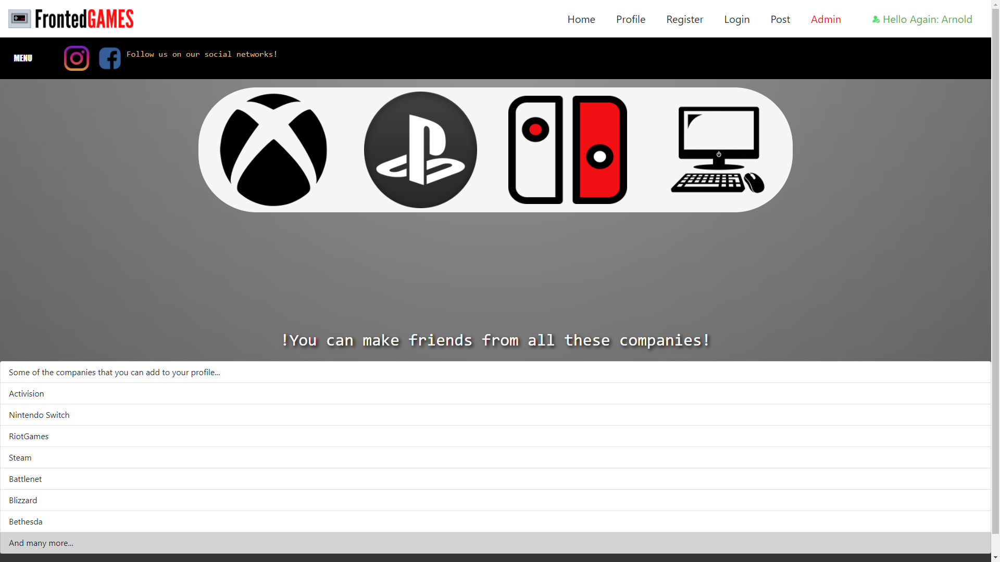
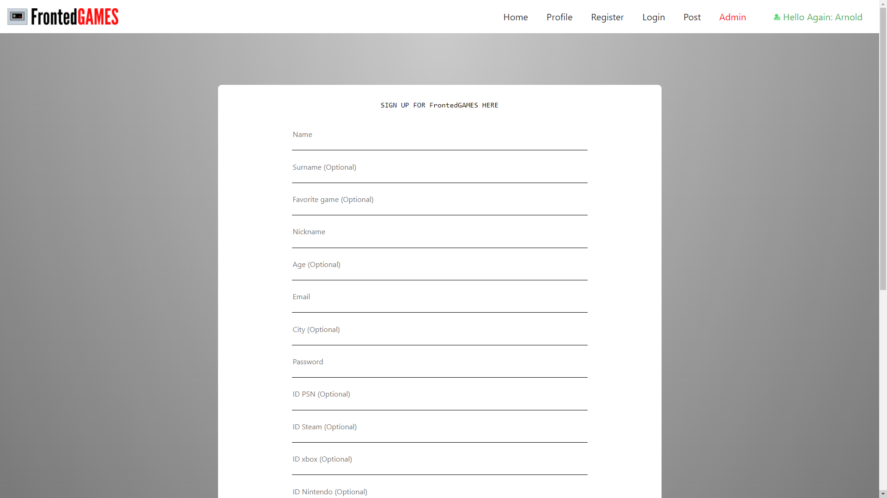
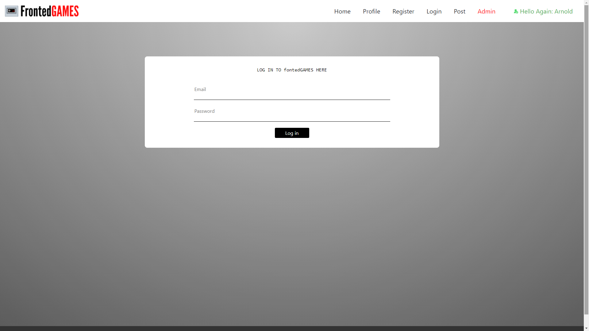
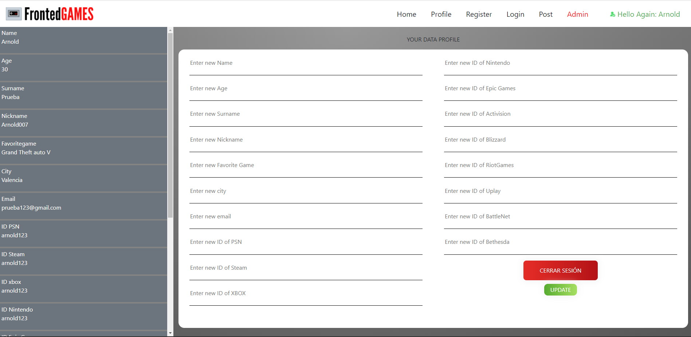
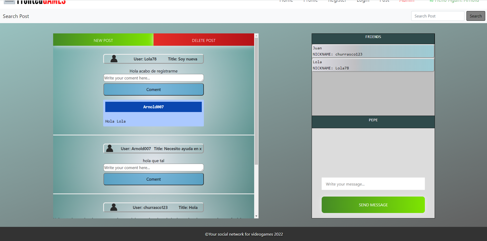
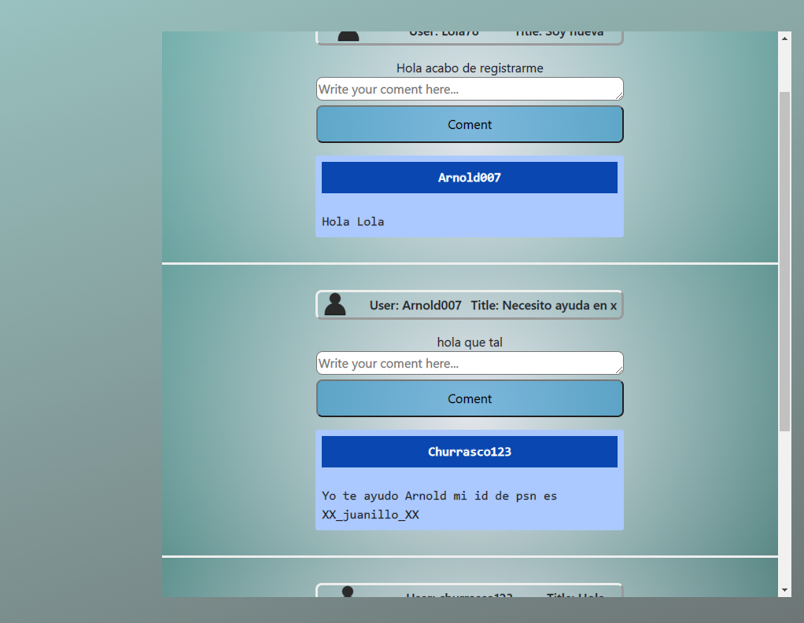
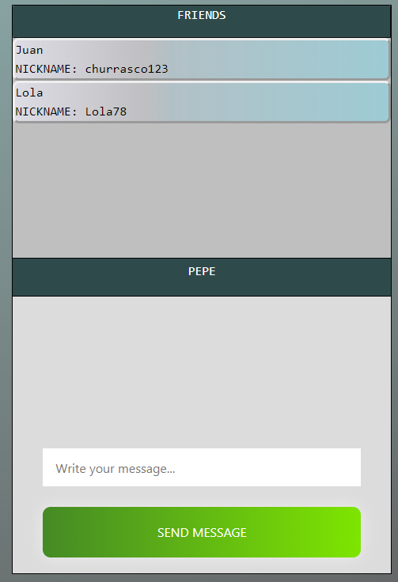

<p aling="center">
  
</p>

# FrontedGAMES Tu red social de videojuegos 2022
<br>

* 🌐 Enlace AWS:https://main.d1zdk2h0thz2b5.amplifyapp.com/
#

* Tu red social de videojuegos ☺ , parte Fronted, se utilizan las tecnologías🔧 :
####

 {
     
 * React;
 * Redux;
 * Html5;
 * SCSS;
 * JS;
 * Axios
 * AWS
 

 }
#

Requisitos para funcionamiento en local 💻:

````
⚙️Clonar repositorio desde esta url https://github.com/Arnoleitor/FrontGAMES_Fronted.git
⚙️Usar el comando git clone "url" sin comillas para clonarlo en tu equipo.
⚙️Comando npm i para instalar todas las librerías necesarias que incluye el proyecto.
⚙️Comando npm start para iniciar el servidor.
````

#
### ℹ️DESCRIPCIÓN
```
En este proyecto he querido realizar una red social dedicada al mundo de los 
videojuegos 100% , con ello quería que se dejara de prescindir de redes sociales 
externas que nada tienen que ver pero aun así se utilizan, he implementado un sistema 
de publicaciones en el cual un usuario puede crear una para pedir ayuda en X 
videojuego o lo que necesite y otros usuarios puedan comentar en dicha publicación.
```
#

### ℹ️Mejoras de futuro 🚀{

* Darle click a un usuario y dar la opción de agregar amigo.
* Poder ver el perfil de tu amigo para poder ver sus ID de las diferentes compañías de videojuegos.
* 100% Responsive y mejor diseño.
* Sistema de chat con amigos.
* incluir imagenes en las publicaciones.

}
#
### ℹ️Opciones disponibles actualmente en la web para el usuario:👥{
* Registro.
* Inicio de sesión.
* poder visualizar tus datos y modificarlos en la zona de perfil.
* Poder crear publicaciones.
* poder realizar comentarios en las publicaciones.
* (Admin) poder ver usuarios registrados y eliminarlos.
* (Admin) poder ver las publicaciones efectuadas.
}
### PAGINAS ℹ️📃
#

* ## Home
#### En este apartado el usuario entra a la web, tiene la opción de acceder al menú superior o el desplegable para registrarse o iniciar sesión, una vez se inicie sesión ya puede ver sus datos de perfil y los posts.
<p aling="center">
  
</p>

* ## Register
#### En este apartado el usuario puede registrarse rellenando todos los datos, actualmente es obligado rellenarlos todos, no puede haber dos correos iguales ni apodos, la contraseña deber ser mínimo de ocho caracteres.
<p aling="center">
  
</p>

* ## Log In

#### En este apartado el usuario puede iniciar sesión, si todo es correcto se le redirecciona a la página Home.Si algún dato es incorrecto se notificará.

<p aling="center">
  
</p>

* ## Profile
#### En este apartado el usuario puede ver todos sus datos, puede modificarlos y puede cerrar la sesión.

<p aling="center">
  
</p>

* ## Posts , Chat and Friends

 #### En este apartado el usuario puede crear publicaciones con un título y un texto, en un futuro agregar imágenes(En este momento hay que incluir un carácter en el input para que se publique correctamente).


<p aling="center">
  
</p>

##

#### Como puede observarse estas serian las publicaciones y sus respectivos comentarios, se incluye el nickname de la persona que lo ha publicado, título, el texto y en un futuro una imagen, también puede observarse que en los comentarios aparece el nickname de la persona que ha realizado dicho comentario.

<p aling="center">
  
</p>
<br>

##
 
#### Esta es la parte en el que se pueden visualizar los amigos del usuario, en un futuro se podrán seleccionar y dicha persona aparecerá en la sección del chat para poder hablar entre los dos usuarios.
<br>

<p aling="center">
  
</p>

#

# Autor ✒️ 
* #### Arnold Carcelén - Desarrollo de la APP y documentación.
